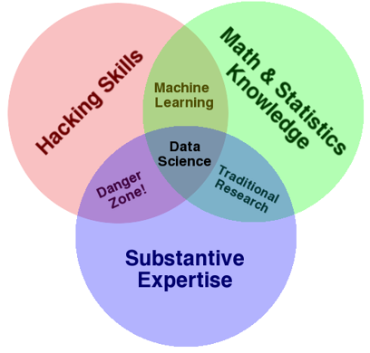
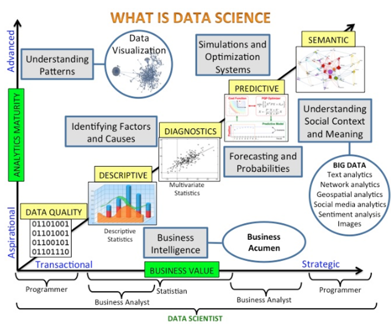
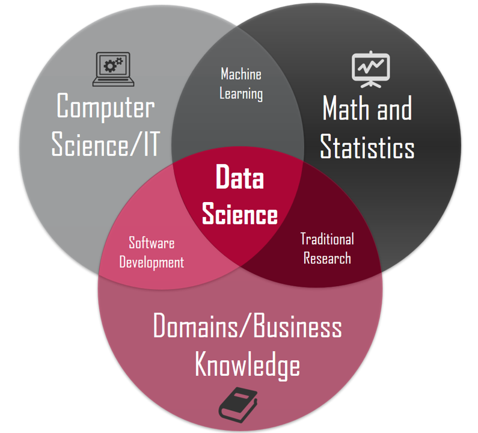

# INTRODUCCIÓN

## Definiciones previas:

- **Tensor**: is a container which can house data in N dimensions, along with its linear operations
- **Normalización**: Ajustar los valores medidos en diferentes escalas respecto a una escala común

## ¿Qué es DATA SCIENCE?

- A multi-disciplinary field that uses scientific methods, processes, algorithms and systems to extract knowledge and insights from data in various forms, both structured and unstructured, similar to data mining.

- A _"concept to unify statistics, data analysis, machine learning and their related methods"_ in order to _"understand and analyze actual phenomena"_ with data.

- It employs techniques and theories drawn from many fields within the context of mathematics, statistics, information science, and computer science.

<!--  -->

- Is the field of study that combines domain expertise, programming skills, and knowledge of math and statistics to extract meaningful insights from data.

- Data science practitioners apply machine learning algorithms to numbers, text, images, video, audio, and more to produce artificial intelligence (AI) systems that perform tasks which ordinarily require human intelligence. In turn, these systems generate insights that analysts and business users translate into tangible business value

<!--  -->
<!-- 
  -->

<!--  -->

**¿Qué NO ES Data Science?**

- No es estadística
- No es computer science
- No es desarrollar modelos complejos
- No es hacer visualizaciones complejas
- Data -> Impact -> Decisions

## Proceso de Data Science

- Discovery
- Data preparation
- Model Planning
- Building Model
- Operationalize
- Comunicate Results

(es cíclico)

## ¿Qué es BIG DATA?

Big data is a term that describes the large volume of data – both structured and unstructured – that inundates a business on a day-to-day basis.

But it’s not the amount of data that’s important. It’s what organizations do with the data that matters.

Big data can be analyzed for insights that lead to better decisions and strategic business moves.

Fuente: SAS

## VVV

- **Volume.** Organizations collect data from a variety of sources. New technologies have eased the burden of storing big volumes of data.

- **Velocity.** Data streams in at an unprecedented speed and must be dealt with in a timely manner. RFID tags, sensors and smart metering are driving the need to deal with torrents of data in near-real time.

- **Variety.** Data comes in all types of formats –structured, numeric data in traditional databases - unstructured text documents, email, video, audio, stock ticker data and financial transactions.

## Machine Learning

Subfield of computer science that is concerned with building algorithms which, to be useful, rely on a collection of examples of some phenomenon.

Machine learning can also be defined as the process of solving a practical problem by
1) Gathering a dataset
2) Algorithmically building a statistical model based on that dataset. That statistical model is assumed to be used somehow to solve the practical problem

### Tipos de Machine Learning:

- Supervised Learning
- Unsupervised Learning
- Semi-Supervised Learning
- Reinforcement Learning

## Competencias de un Data Scientist:

- Habilidades Comunicativas
- Capacidad para aprender rápido
- Pensamiento crítico
- Habilidades específicas del área de análisis
- Ética
- Capacidades computacionales
