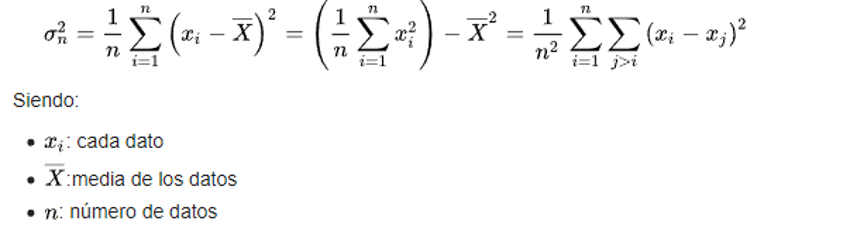

# Analítica Básica

Es transformar datos en información.

**Objetivo:** dar respuesta a preguntas

- Estas preguntas pueden provenir de distintas fuentes; científicas, empresariales, marketing, etc.

## Conceptos básicos

1. **Ratio**

Comparación de dos números.

Se expresa como: A por B
`A : B`

Cálculo:
`A / B`

2. **Proporción**

Ratio en que componentes del numerados también se encuentra contado en el denominador.

Usado para comparar partes de algo completo.

3. **Porcentaje**

Proporción pero por 100 y expresada con el símbolo '%'

4. **Tasa**

Medida comparada respecto a otra durante el mismo periodo de tiempo.

Usada para explicar frecuencia de eventos específicos en un periodo de tiempo.

Ej: Tasa de mortalidad.

5. **Media**

Promedio de todos los valores (media aritmética)

6. **Mediana**

Valor que divide los datos justo en la mitad (datos ordenados)

Cantidad de datos pares: (datos[n/2] + datos [(n/2) + 1]) / 2

Cantidad de datos impares: datos[(n+1)/2]

7. **Moda**

Valor mas repetido del dataset.

8. **Rango**

Intervalo entre valor máximo y valor mínimo

Permite obtener una idea de la dispersión de los datos

R = max(x) - min(x)

9. **Varianza**

Medida de dispersión

Definición:

10. **Desviación estándar**

Cuantifica la variación/dispersión de un conjunto de datos numéricos.

11. **Correlación**

Indica la fuerza y la dirección de una relación lineal y proporcionalidad entre variables estadísticas.

Se considera que dos variables cuantitativas están correlacionadas cuando los valores de una de ellas varían sistemáticamente con respecto a los valores homónimos de la otra

La correlación entre dos variables no implica causalidad

12. **Cuartiles**
