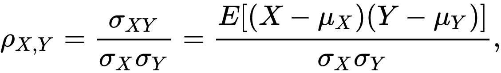
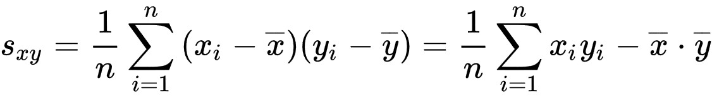

# Análisis de Varianza

## Correlación de pearson

<!--  -->

## Covarianza

Valor que indica el grado de variación conjunta de dos variables aleatorias respecto a sus medias.

Es el dato básico para determinar si existe una dependencia entre ambas variables.

Es necesario para estimar otros parámetros básicos, como el coeficiente de correlación lineal o la recta de regresión.

<!-- !(Pearson correlation)[] -->

**Interpretacion**

|**Relacion**|**Interpretacion**|
|---|---|
|S(xy) > 0| Dependencia directa (positiva). |
|S(xy) = 0| No hay relacion lineal entre las variables |
|S(xy) < 0| Dependencia inversa (negativa). |

## Diferencia entre correlacion y covarianza

La covarianza mide la relación lineal entre dos variables.

Aunque la covarianza es similar a la correlación, difieren en lo siguiente:

|**Correlacion**|**Covarianza**|
|---|---|
|Los coeficientes de correlación están estandarizados| Los valores de covarianza no están estandarizados. Por consiguiente, la covarianza puede ir desde infinito negativo hasta infinito positivo|
|una relación lineal perfecta da como resultado un coeficiente de 1|El valor de una relación lineal perfecta depende de los datos.|
|La correlación mide tanto la fuerza como la dirección de la relación lineal entre dos variables.|  Puesto que los datos no están estandarizados, es difícil determinar la fuerza de la relación entre las variables. |

## Relación entre correlación y covarianza

- El coeficiente de correlación depende de la covarianza.
- El coeficiente de correlación es igual a la covarianza dividida entre el producto de las desviaciones estándar de las variables
- Por lo tanto, una covarianza positiva -> correlación positiva y covarianza negativa -> correlación negativa.

`correlación=covarianza/(desvest(X)-desvest(Y))`

<!-- You can use $$\LaTeX$$ to typeset formulas. A formula can be displayed inline, e.g. $$e=mc^2$$, or as a block: -->

## ANOVA (Análisis de Varianza)

Los **análisis de varianza** son una colección de métodos para comparar múltiples medias de diferentes grupos.

¿Existe una dependencia de las variables cuantitativas (medias) según los grupos de las variables categóricas?

Sus aplicaciones están generalmente más asociado al análisis de experimentos y específicamente a tratamientos en medicina.

La prueba de significancia se realiza utilizando la distribución F de Snedecor (F-test value)
